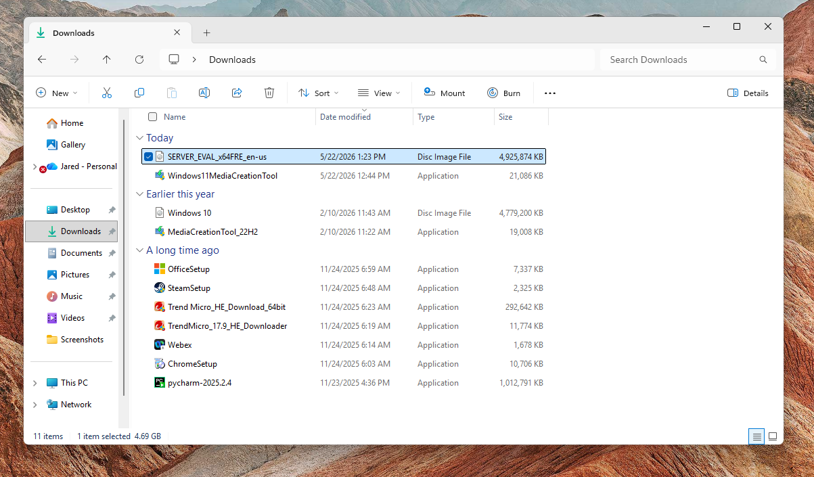
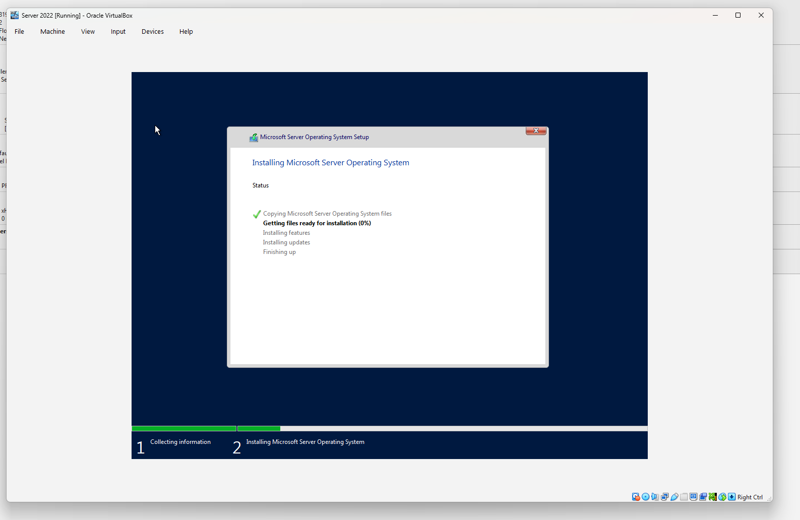
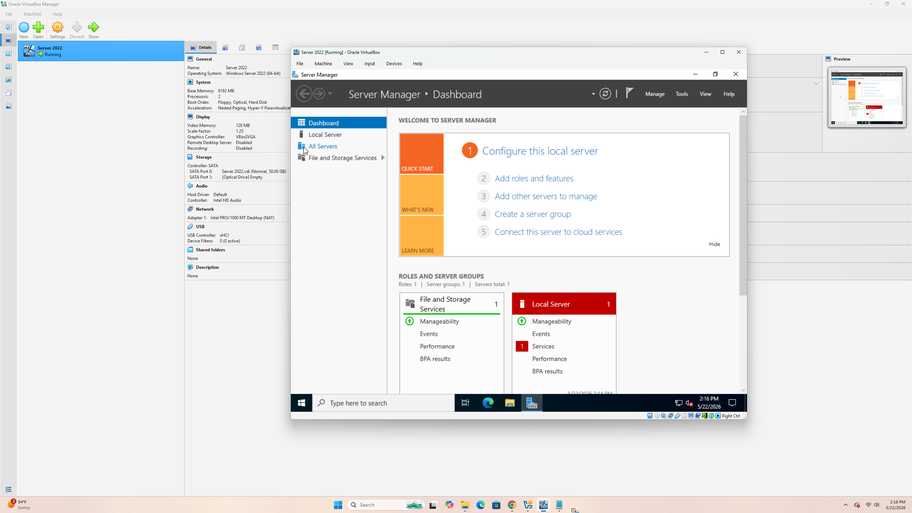
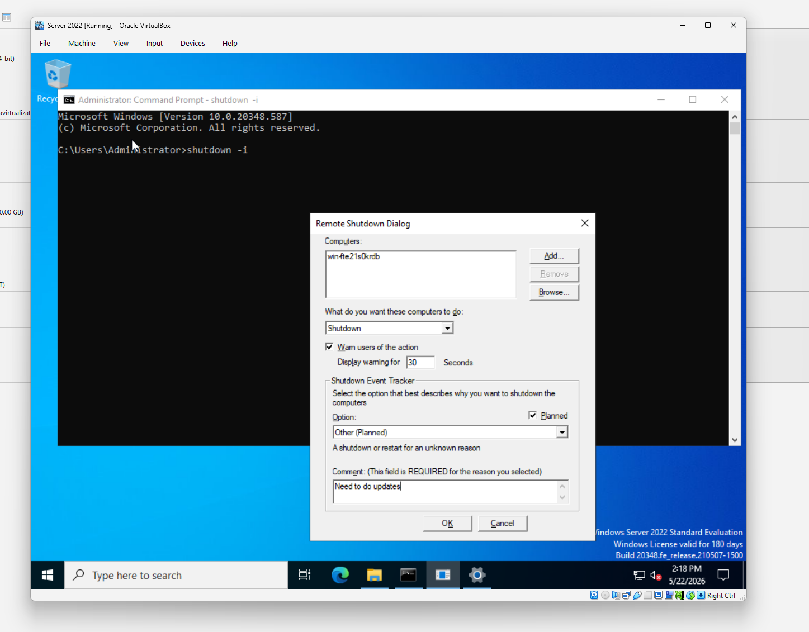

# Phase 1 – Infrastructure Setup

## Overview

The purpose of this phase was to build the foundational infrastructure required for the homelab environment. This included deploying a Windows Server 2022 Domain Controller, creating a Windows 11 client workstation, configuring networking, and joining the workstation to the Active Directory domain.

By the end of this phase, a functional Active Directory environment was established consisting of a domain controller and a domain-joined Windows 11 workstation capable of authenticating domain users and accessing domain resources.

---

## Objectives

* Deploy Windows Server 2022 in a virtualized environment
* Install Windows 11 Pro as a client workstation
* Configure network connectivity between systems
* Create and configure an Active Directory domain
* Promote the server to a Domain Controller
* Join a workstation to the domain
* Verify communication and authentication between systems

---

## Lab Environment

### Virtualization Platform

* VirtualBox

### Server

| Setting          | Value               |
| ---------------- | ------------------- |
| Hostname         | AZ-DC-01            |
| Operating System | Windows Server 2022 |
| Memory           | 8 GB RAM            |
| Processors       | 2 vCPUs             |
| Role             | Domain Controller   |

### Client Workstation

| Setting          | Value                     |
| ---------------- | ------------------------- |
| Hostname         | WIN11-CLIENT              |
| Operating System | Windows 11 Pro            |
| Role             | Domain-Joined Workstation |

### Domain Information

| Setting     | Value       |
| ----------- | ----------- |
| Domain Name | homelab.com |
| Forest Name | homelab.com |

---

# Part A – Windows Server 2022 Installation

## Creating the Virtual Machine

A new virtual machine was created within VirtualBox to host Windows Server 2022.

The virtual machine was configured with:

* 8 GB RAM
* 2 virtual processors
* Virtual hard disk storage
* Windows Server 2022 installation ISO

After configuring the virtual hardware, the Windows Server 2022 ISO was mounted and the installation process was started.

### Screenshot



---

## Installing Windows Server 2022

The Windows Server installation wizard was completed using the default installation options.

After installation:

* Administrative credentials were configured
* Initial system setup was completed
* The server successfully booted into Windows Server 2022

### Screenshot





---

## Administrative Tool Verification

To verify command-line administrative functionality, Command Prompt was opened and the following command was executed:

```cmd
shutdown -i
```

This launched the Remote Shutdown Dialog, demonstrating access to common administrative management tools.

### Screenshot



---

# Part B – Active Directory Deployment

## Renaming the Server

Prior to installing Active Directory, the server was renamed to:

```text
AZ-DC-01
```

Using a standardized naming convention improves identification and management of enterprise systems.

The server was restarted to apply the hostname change.

### Screenshot

*Insert screenshot showing system properties with AZ-DC-01 hostname*

---

## Installing Active Directory Domain Services

Using Server Manager, the following role was installed:

```text
Active Directory Domain Services (AD DS)
```

The Add Roles and Features Wizard was used to complete the installation.

### Screenshot

*Insert screenshot showing AD DS role installation*

---

## Promoting the Server to a Domain Controller

Following installation of the AD DS role, the server was promoted to a Domain Controller.

A new forest was created using:

```text
homelab.com
```

The Active Directory configuration wizard completed successfully and the server restarted automatically.

### Screenshot

*Insert screenshot showing domain creation wizard*

---

## Verification

Several commands were used to verify the successful deployment of Active Directory and Domain Controller services.

### Identify Current User

```cmd
whoami
```

### Review Domain Password Policies

```cmd
net accounts
```

### Review Domain Administrator Account

```cmd
net user administrator /domain
```

### Review System Information

```cmd
systeminfo
```

These commands confirmed:

* Domain Controller status
* Domain membership
* Forest configuration
* Hostname configuration

### Screenshot

*Insert screenshot showing command verification output*

---

# Part C – Windows 11 Client Deployment

## Creating the Windows 11 Virtual Machine

A second virtual machine was created in VirtualBox to simulate an enterprise workstation.

The Windows 11 ISO was attached and the installation process was initiated.

### Troubleshooting Encountered

During installation, the virtual machine displayed a black screen and would not boot.

Research indicated that VirtualBox users frequently resolve this issue by increasing processor allocation.

The number of assigned processors was increased, after which the virtual machine booted successfully and installation continued.

### Screenshot

*Insert screenshot showing Windows 11 VM configuration*

---

## Windows 11 Installation

Windows 11 Pro was installed as the client operating system.

Because Windows 11 required Microsoft account authentication during setup, the installation process was bypassed using:

```cmd
oobe\bypassnro
```

This command restarted the Out-of-Box Experience (OOBE) and restored the option to continue installation without an internet connection.

This allowed creation of a local administrator account for lab purposes.

### Screenshot

*Insert screenshot showing OOBE bypass process*

---

# Part D – Network Configuration

## Configuring Network Settings

Network settings were manually configured on both systems to ensure communication between the Domain Controller and workstation.

DNS settings on the Windows 11 workstation were configured to point to the Domain Controller.

### Verification

Connectivity was verified using:

```cmd
ping homelab.com
```

Successful responses confirmed proper DNS resolution and network communication.

### Screenshot

*Insert screenshot showing successful ping results*

---

# Part E – Domain Join

## Joining the Workstation to the Domain

The Windows 11 workstation was joined to the domain through:

```text
Settings
→ System
→ About
→ Advanced System Settings
→ Computer Name
→ Change
```

The workstation was configured to join:

```text
homelab.com
```

Domain Administrator credentials were provided when prompted.

The workstation was restarted after the join process completed.

### Screenshot

*Insert screenshot showing successful domain join message*

---

## Verifying Computer Object Creation

On the Domain Controller, Active Directory Users and Computers was opened.

The newly joined workstation appeared within the Computers organizational unit.

This confirmed successful domain registration.

### Screenshot

*Insert screenshot showing computer object in ADUC*

---

# Part F – Domain User Authentication Testing

## Logging in with a Domain Account

A domain user account was used to log into the Windows 11 workstation.

Authentication succeeded through Active Directory, confirming that domain services were functioning correctly.

### Screenshot

*Insert screenshot showing domain login screen*

---

## Remote Desktop Testing

Remote Desktop Connection was launched from the Windows 11 workstation.

The workstation successfully connected to the Domain Controller using Remote Desktop Protocol (RDP).

This verified:

* Network connectivity
* DNS functionality
* Authentication services
* Remote administration capabilities

### Screenshot

*Insert screenshot showing RDP session connected to AZ-DC-01*

---

# Skills Demonstrated

* VirtualBox administration
* Windows Server 2022 deployment
* Windows 11 deployment
* Active Directory Domain Services installation
* Domain Controller promotion
* DNS configuration
* Domain management
* Workstation domain joining
* User authentication testing
* Remote Desktop administration
* Troubleshooting Windows installation issues
* Network connectivity verification

---

# Outcome

A fully functional Active Directory environment was successfully deployed consisting of a Windows Server 2022 Domain Controller and a Windows 11 domain-joined workstation.

The infrastructure established during this phase serves as the foundation for subsequent phases involving user administration, Group Policy management, endpoint management, file services, print services, and help desk operations.
