# Phase 2 – Active Directory Administration

## Overview

The purpose of this phase was to develop practical experience administering Active Directory objects and permissions. Tasks included creating and managing users, configuring account restrictions, organizing resources with Organizational Units (OUs), implementing security groups, and delegating administrative privileges.

These activities simulate common responsibilities performed by Help Desk Technicians, System Administrators, and Identity Management teams in enterprise environments.

---

## Objectives

* Create and manage user accounts
* Configure account restrictions and logon settings
* Create and manage Organizational Units
* Create and manage security groups
* Verify user account properties using command-line tools
* Search and manage Active Directory objects
* Delegate administrative permissions to users

---

## Environment

### Domain Controller

* Hostname: AZ-DC-01
* Operating System: Windows Server 2022

### Domain

* homelab.com

### Tools Used

* Active Directory Users and Computers (ADUC)
* Command Prompt
* Active Directory Delegation Wizard

---

# Part A – User Account Creation

## Creating Domain Users

Using Active Directory Users and Computers, new user accounts were created within the Users organizational unit.

### User Accounts Created

| Username      | Purpose                 |
| ------------- | ----------------------- |
| John Computer | Test domain user        |
| Mike          | Standard user account   |
| Scott         | Delegated administrator |

The user creation process included:

* First and last name assignment
* Username creation
* Password assignment
* Disabling the "User must change password at next logon" option

### Screenshot

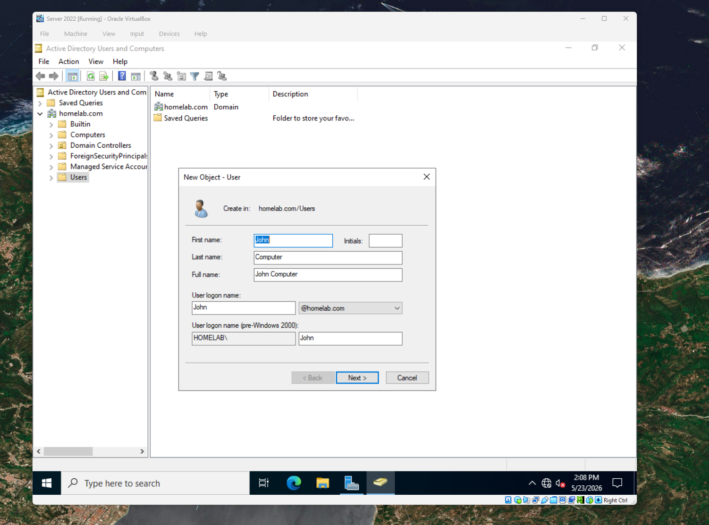

---

## Verification

The following command was used to verify account creation:

```cmd
net user john /domain
```

The output confirmed:

* Account existence
* Password settings
* Group membership
* Logon restrictions

### Screenshot

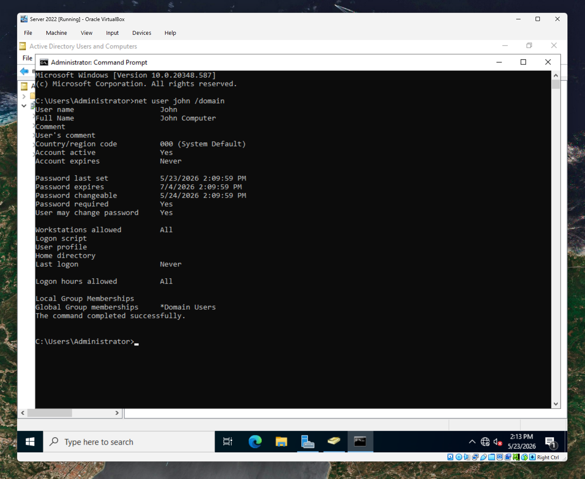

---

# Part B – Account Restrictions

## Configuring Logon Hours

To simulate common security controls, logon restrictions were configured for John Computer.

The account was limited to:

* Monday through Friday
* 9:00 AM – 5:00 PM

These settings were configured under:

```text
User Properties
→ Account
→ Logon Hours
```

### Screenshot

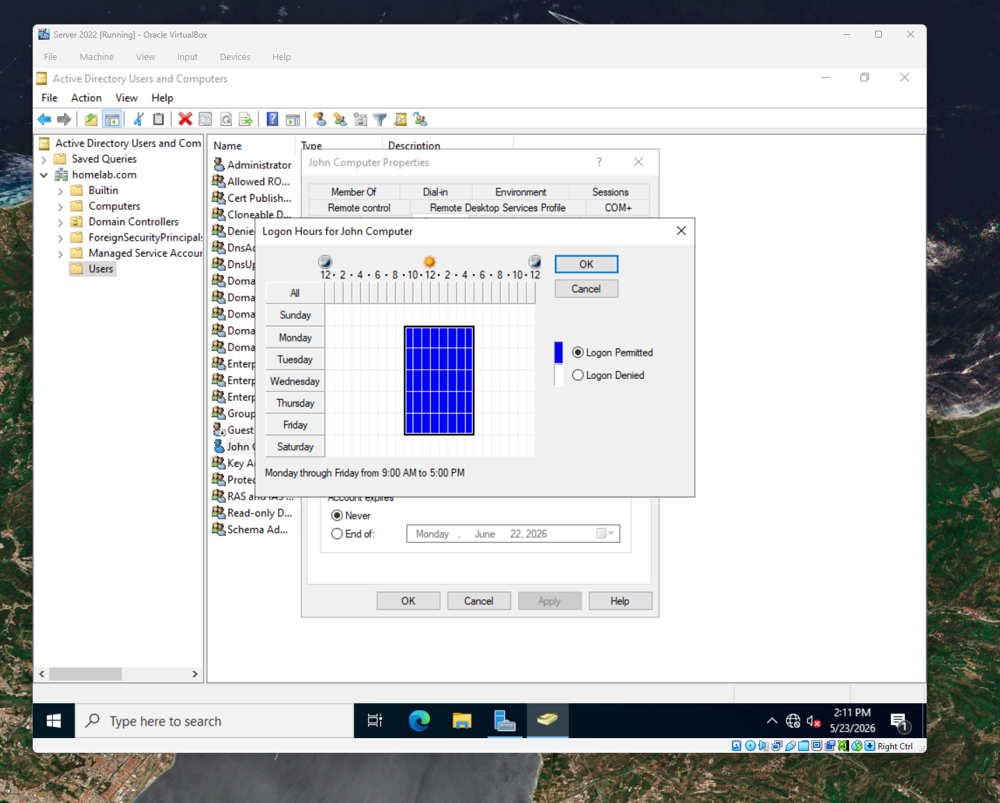

---

## Testing Disabled Accounts

The Mike account was disabled within Active Directory.

Login attempts were performed to verify that the account could no longer authenticate.

This generated an account-disabled error message similar to those commonly encountered by Help Desk personnel.

### Screenshot

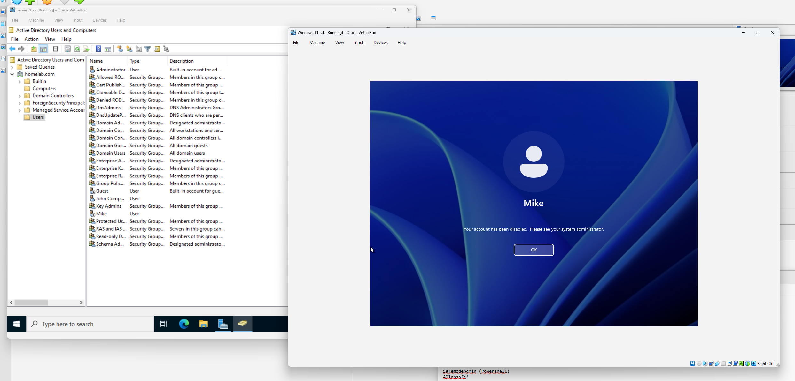

---

## Testing Account Expiration

The Mike account expiration date was modified to simulate an expired user account.

Authentication attempts confirmed that the account expiration policy was functioning correctly.

### Screenshot

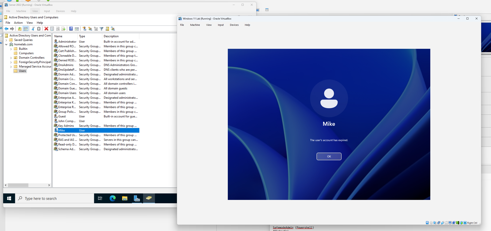

---

# Part C – Organizational Unit Management

## Creating an Organizational Unit

A new Organizational Unit (OU) named:

```text
IT
```

was created within the domain.

The Mike user account was moved into the IT OU.

Organizational Units are commonly used to:

* Organize users
* Delegate administration
* Apply Group Policy Objects (GPOs)

### Screenshot

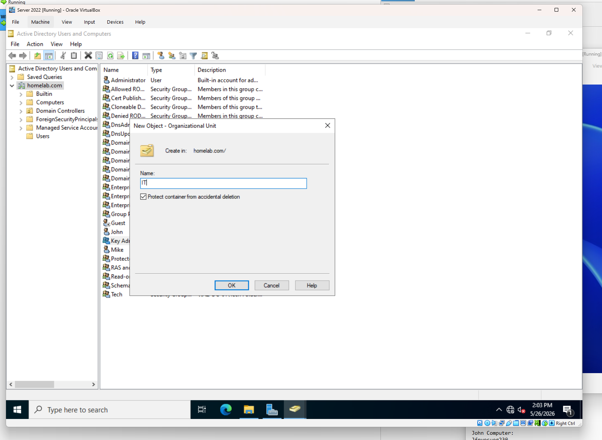

---

## Searching for Active Directory Objects

The Find feature in Active Directory Users and Computers was used to locate the Mike account.

This demonstrated how administrators can quickly locate objects within large environments.

### Screenshot

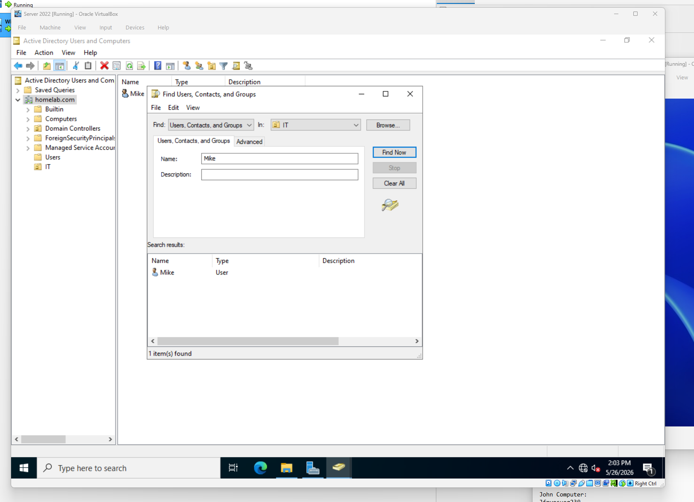

---

## Deleting an Organizational Unit

To remove the IT OU, protection against accidental deletion had to be disabled.

Steps:

1. Enable Advanced Features.
2. Open OU Properties.
3. Open Object tab.
4. Uncheck:

   * Protect object from accidental deletion

The OU was then successfully deleted.

### Screenshot

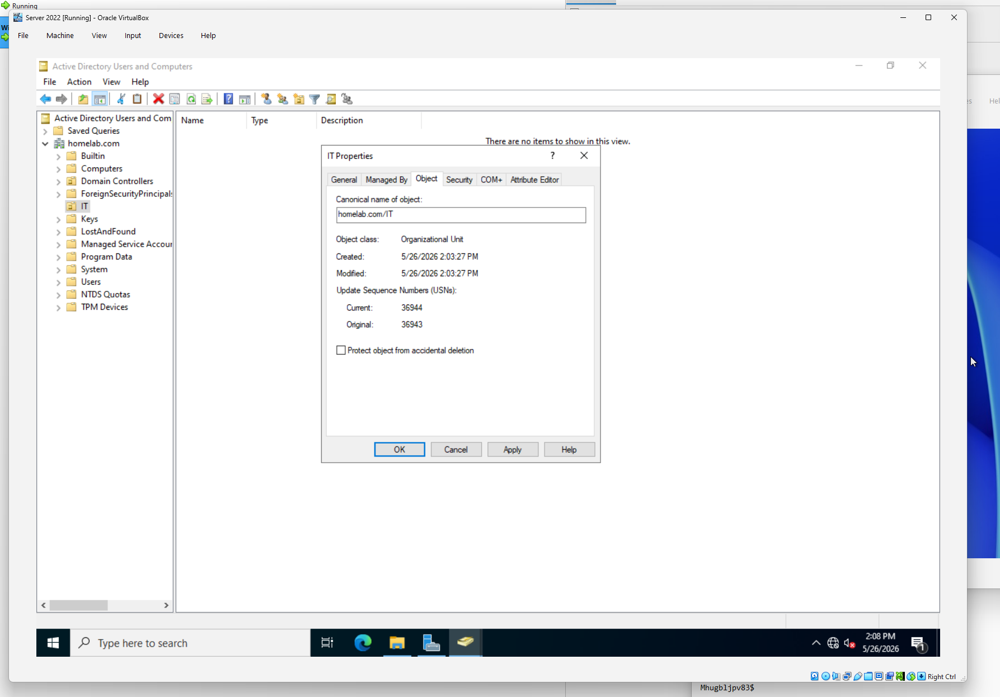

---

# Part D – Security Group Administration

## Creating Security Groups

To simplify permission management, security groups were created within Active Directory.

### Groups Created

| Group Name | Purpose              |
| ---------- | -------------------- |
| Tech       | Shared folder access |
| Personal   | Home folder access   |

### Screenshot

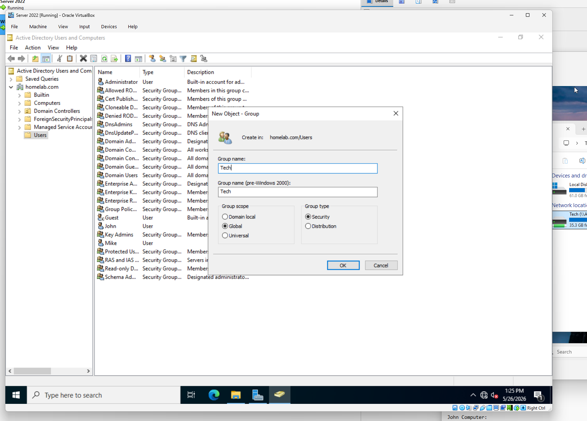

---

## Adding Members to Groups

The Mike account was added to:

* Tech
* Personal

This allowed permissions to be assigned through groups rather than directly to individual users.

Benefits include:

* Simplified administration
* Reduced permission sprawl
* Improved scalability

### Screenshot

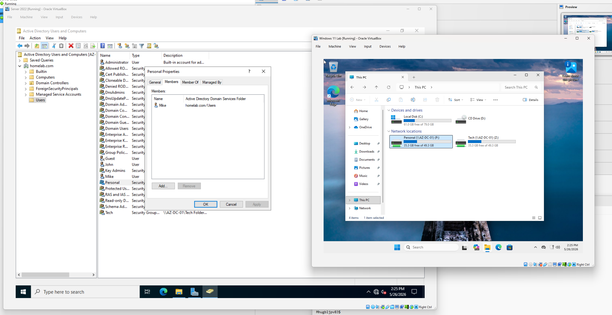

---

## Verifying Group Membership

Membership was verified through:

```cmd
net user mike /domain
```

The command output displayed the groups assigned to the user.

### Screenshot


---

# Part E – Delegation of Control

## Creating a Delegated Administrator

A new user account named Scott was created.

A new Organizational Unit named:

```text
Consultants
```

was also created.

Scott was placed within this OU.

### Screenshot

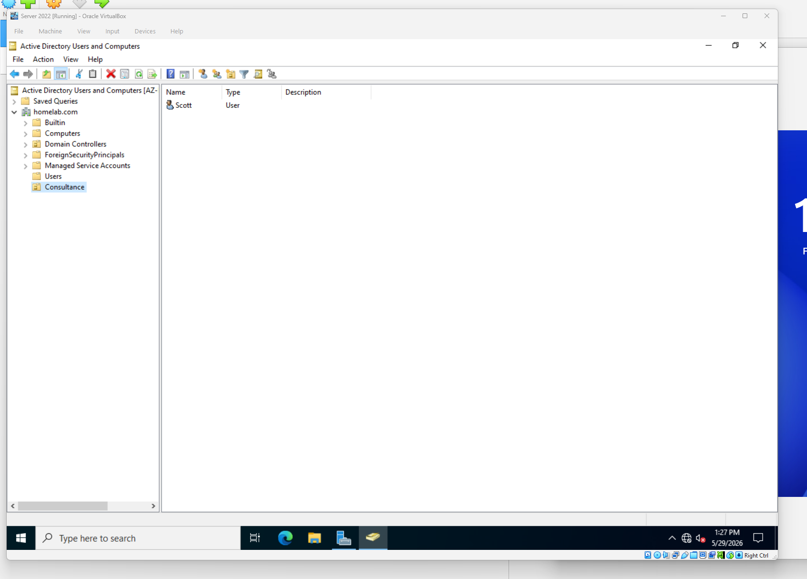

---

## Delegating Administrative Tasks

Using the Delegation of Control Wizard, limited administrative rights were assigned to Scott.

Delegated permissions:

* Reset user passwords
* Force password changes at next logon

This configuration follows the principle of least privilege by granting only the permissions required for a specific role.

### Screenshot

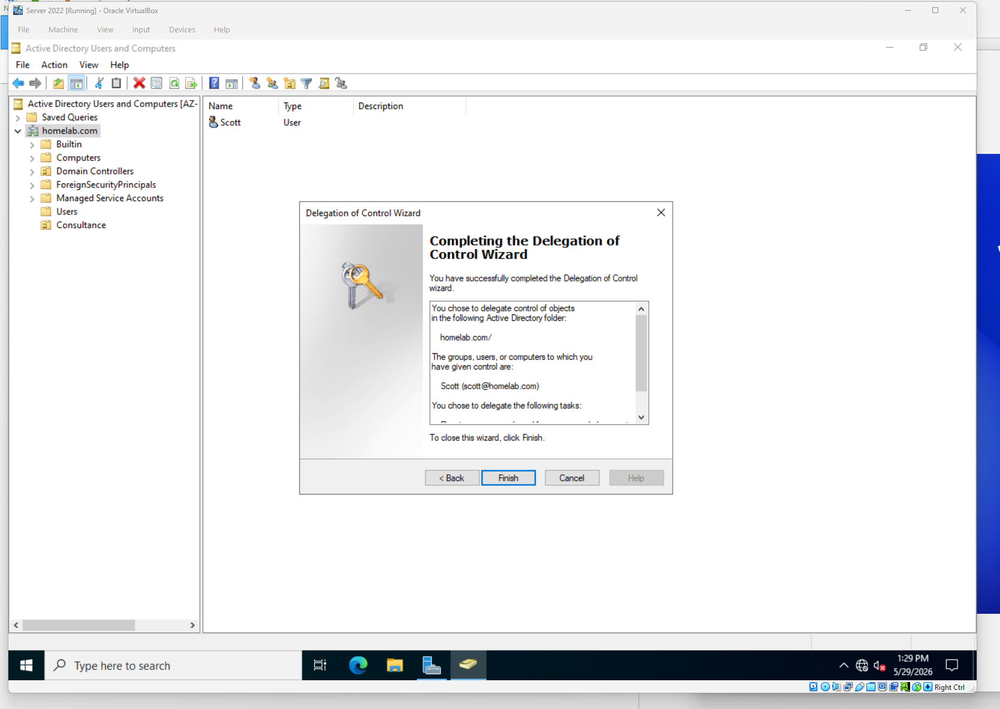

---

## Verification

Scott logged into the domain and verified delegated permissions.

Testing confirmed:

* Password reset functionality was available
* Additional administrative privileges were not granted

This demonstrated successful implementation of role-based administration.

---

# Skills Demonstrated

* Active Directory administration
* User account creation and management
* Account restriction management
* Organizational Unit administration
* Security group management
* Active Directory object searches
* User account troubleshooting
* Command-line administration
* Delegation of control
* Role-based access control (RBAC)
* Principle of least privilege

---

# Outcome

A functional Active Directory administrative structure was implemented within the homelab environment. User accounts, Organizational Units, and security groups were created and managed according to enterprise best practices. Administrative responsibilities were delegated using least-privilege principles, providing hands-on experience with identity and access management concepts commonly used in corporate environments.
