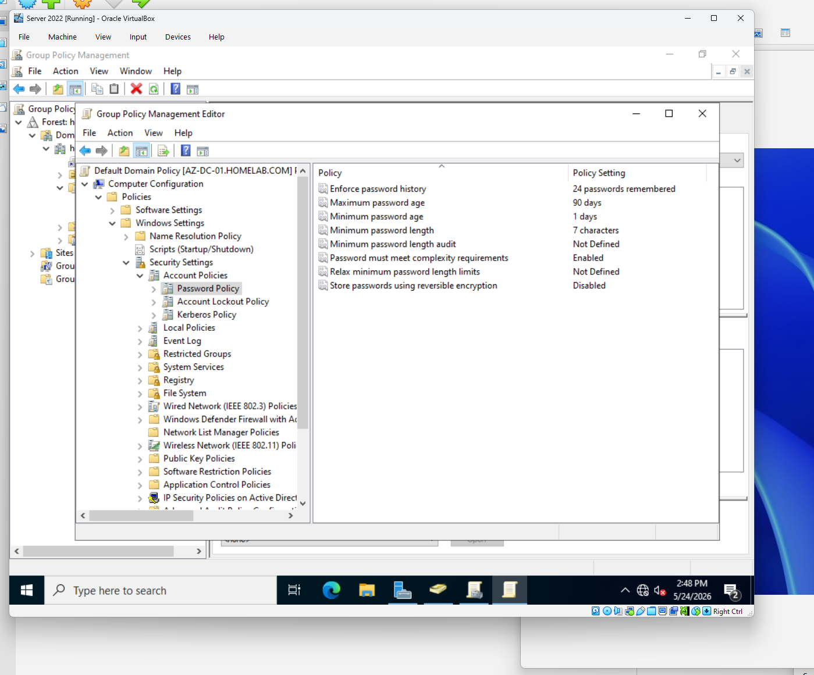
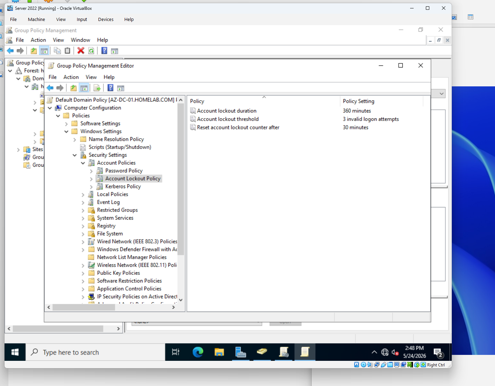
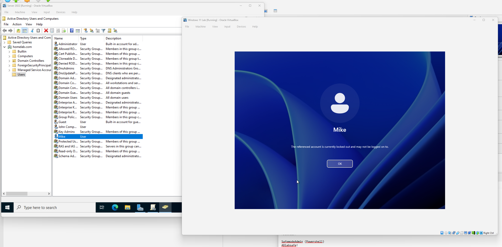
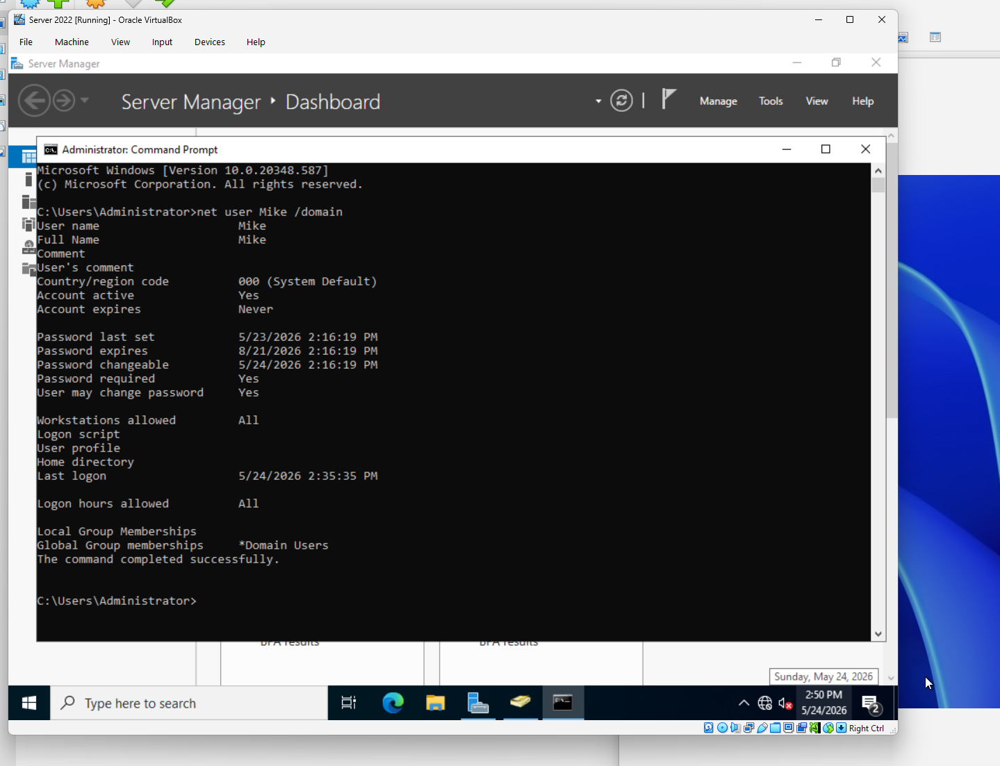
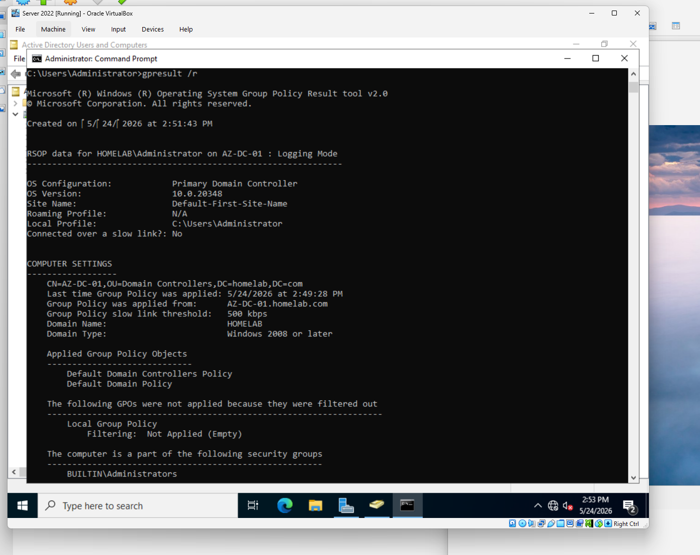
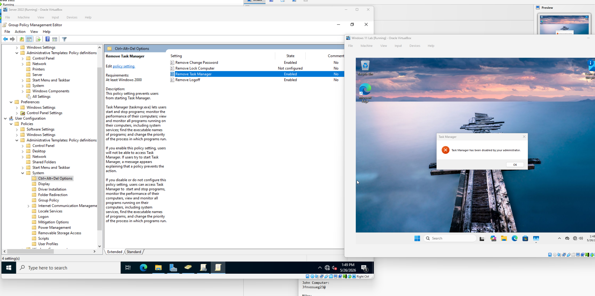
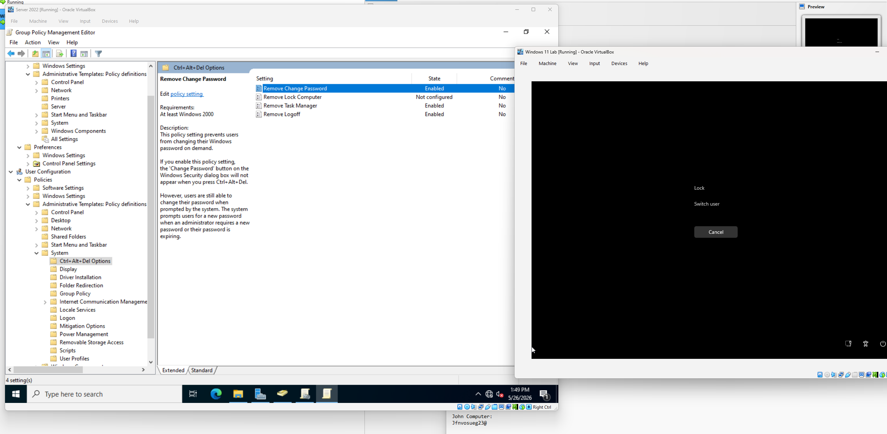
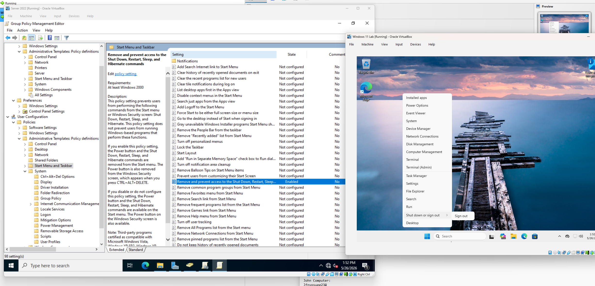

# Phase 3 – Group Policy Management

## Overview

The purpose of this phase was to gain hands-on experience administering Group Policy Objects (GPOs) within an Active Directory environment. Group Policy is one of the most important management tools available to Windows administrators and is widely used to enforce security standards, manage user settings, and standardize configurations across an organization.

In this phase, password policies, account lockout settings, and user restrictions were configured and tested to simulate common enterprise security controls.

---

## Objectives

* Configure domain-wide password policies
* Configure account lockout policies
* Test account lockout functionality
* Restrict user access to Task Manager
* Prevent users from changing passwords
* Restrict shutdown and restart options
* Verify policy application using command-line tools

---

## Environment

### Domain Controller

* Hostname: AZ-DC-01
* Operating System: Windows Server 2022

### Client Workstation

* Windows 11 Pro
* Domain Joined

### Domain

* homelab.com

### Tools Used

* Group Policy Management
* Active Directory Users and Computers
* Command Prompt
* Resultant Set of Policy (RSoP)

---

# Part A – Password Policy Configuration

## Accessing Group Policy Management

Group Policy Management was opened from:

```text
Server Manager
→ Tools
→ Group Policy Management
```

The Default Domain Policy was selected and edited.

---

## Configuring Password Policy

The following location was accessed:

```text
Computer Configuration
→ Policies
→ Windows Settings
→ Security Settings
→ Account Policies
→ Password Policy
```

Several password settings were modified to demonstrate domain-wide password enforcement.

Examples of configurable settings include:

* Minimum password length
* Maximum password age
* Password complexity requirements
* Password history

### Screenshot



---

## Applying the Policy

After modifying the password policy, the Default Domain Policy was enforced to ensure the settings would apply across the domain.

---

# Part B – Account Lockout Policy

## Configuring Lockout Settings

Within the Account Policies section, the following path was accessed:

```text
Computer Configuration
→ Policies
→ Windows Settings
→ Security Settings
→ Account Policies
→ Account Lockout Policy
```

Account lockout settings were configured to improve security and protect against password guessing attacks.

### Example Settings

| Setting             | Value      |
| ------------------- | ---------- |
| Lockout Threshold   | 3 Attempts |
| Lockout Duration    | Configured |
| Reset Counter After | Configured |

### Screenshot



---

## Testing Account Lockout

The Mike account was used to test lockout functionality.

Three incorrect passwords were entered during login attempts.

The account became locked according to the configured policy.

This simulates a common Help Desk support issue where users are unable to log in due to account lockout events.

### Screenshot



---

## Unlocking the Account

Using Active Directory Users and Computers:

1. Open Mike's account properties
2. Navigate to the Account tab
3. Unlock the account

This restored access for the user.

---

# Part C – Policy Verification

## Verifying User Settings

To verify that policy changes had been applied, Command Prompt was used.

The following command was executed:

```cmd
net user mike /domain
```

The output displayed account information including password and lockout-related settings.

### Screenshot



---

## Viewing Applied Group Policies

The following command was executed:

```cmd
gpresult /r
```

This command displays the Resultant Set of Policy (RSoP), which identifies policies currently applied to the system and user.

Administrators commonly use this command when troubleshooting Group Policy issues.

### Screenshot



---

# Part D – User Restriction Policies

## Removing Task Manager Access

To simulate user restrictions commonly found in managed environments, the following policy was configured:

```text
User Configuration
→ Policies
→ Administrative Templates
→ System
→ Ctrl + Alt + Del Options
→ Remove Task Manager
```

The policy was enabled.

---

## Verification

The Mike account was used to log into the Windows 11 workstation.

Attempting to launch Task Manager resulted in a restriction message confirming that the policy had been applied successfully.

### Screenshot



---

# Part E – Password Change Restrictions

## Removing Change Password Option

The following policy was enabled:

```text
User Configuration
→ Policies
→ Administrative Templates
→ System
→ Ctrl + Alt + Del Options
→ Remove Change Password
```

This removed the ability for users to change their own passwords through the Windows security menu.

---

## Verification

After logging into the workstation, the Change Password option was no longer available.

### Screenshot



---

# Part F – Shutdown Restrictions

## Restricting Shutdown Options

To further demonstrate Group Policy administration, shutdown-related options were removed from the Start Menu.

The following policy was configured:

```text
User Configuration
→ Policies
→ Administrative Templates
→ Start Menu and Taskbar
→ Remove and Prevent Access to the Shut Down, Restart, Sleep, and Hibernate Commands
```

The policy was enabled.

---

## Verification

The Windows 11 workstation was used to verify policy application.

The following options were removed:

* Shut Down
* Restart
* Sleep
* Hibernate

This confirmed successful deployment of the policy.

### Screenshot



---

# Troubleshooting Techniques Used

Throughout this phase, several troubleshooting methods were used:

### Group Policy Validation

```cmd
gpresult /r
```

### User Account Verification

```cmd
net user mike /domain
```

### Account Unlocking

* Active Directory Users and Computers
* Account Properties
* Unlock Account

These tools are commonly used by Help Desk and Systems Administration teams when diagnosing authentication and policy-related issues.

---

# Skills Demonstrated

* Group Policy Management
* Password Policy Administration
* Account Lockout Management
* User Restriction Policies
* Security Policy Enforcement
* Authentication Troubleshooting
* Account Recovery Procedures
* Policy Verification
* Windows Security Administration
* Help Desk User Support

---

# Outcome

Domain-wide password and account lockout policies were successfully implemented and tested. Additional user restrictions were enforced through Group Policy, including disabling Task Manager access, preventing password changes, and restricting shutdown options. Policy deployment and enforcement were validated using administrative tools and command-line troubleshooting techniques, providing practical experience with one of the most important management systems in a Windows enterprise environment.
