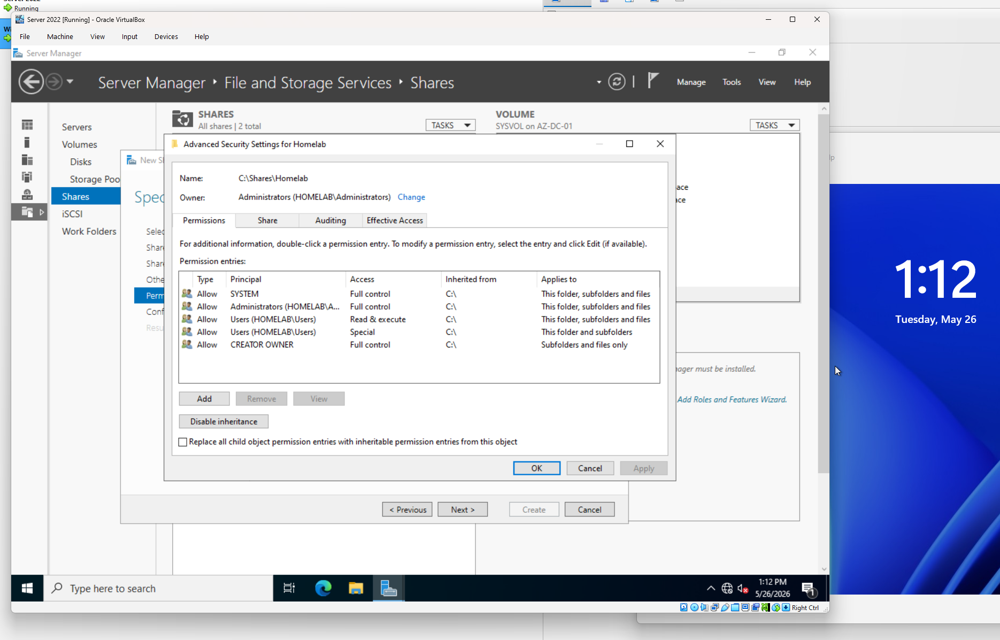
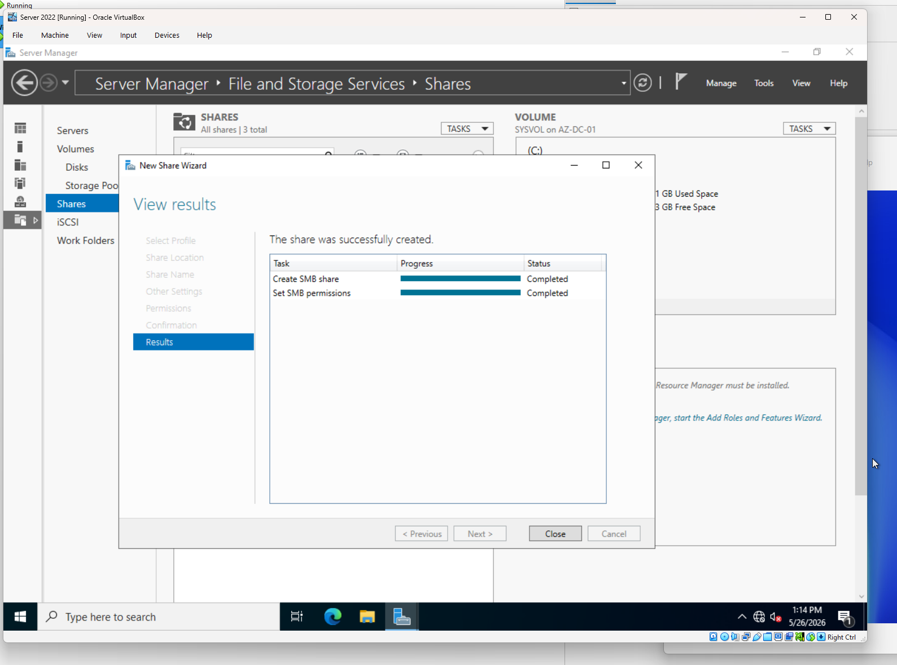
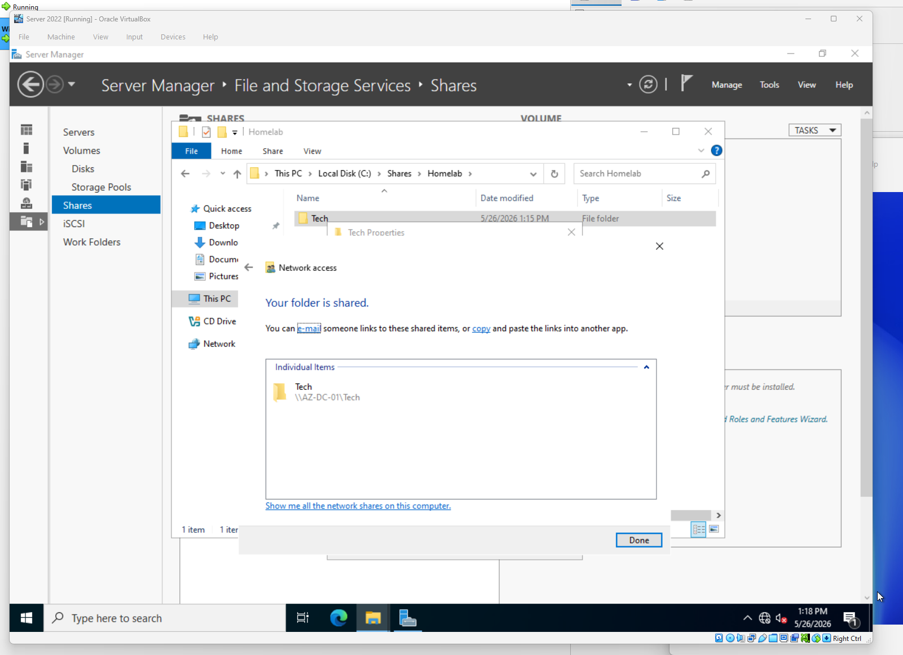
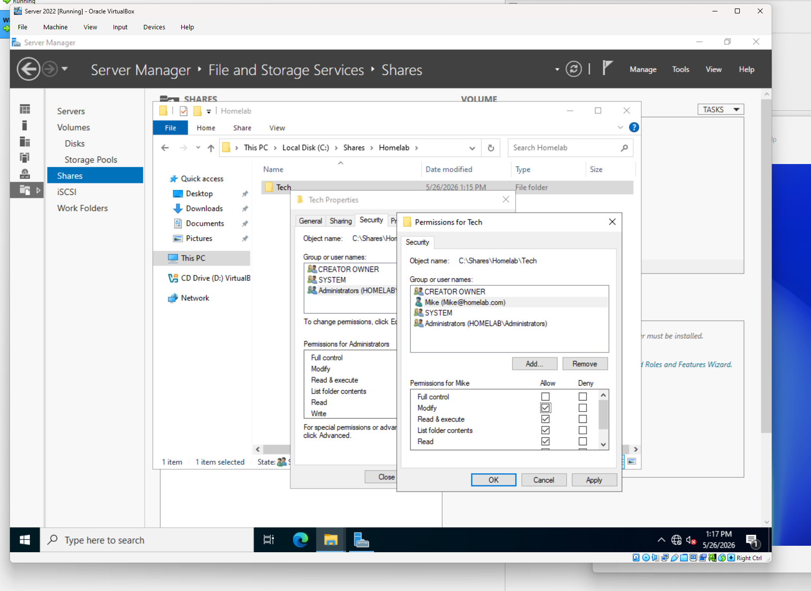
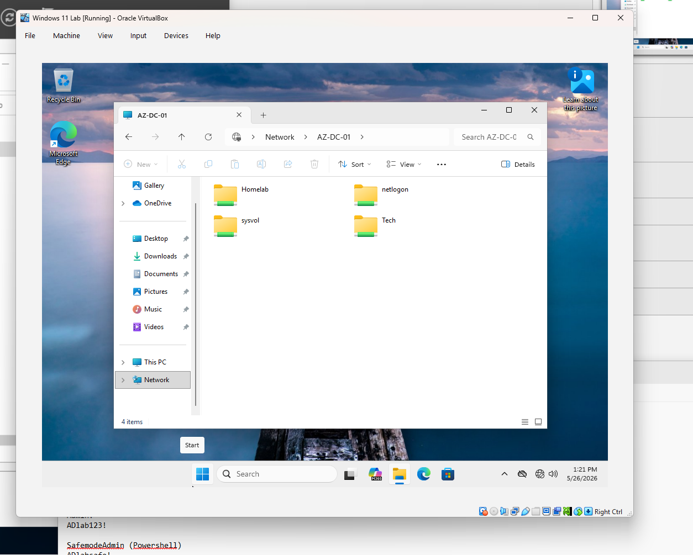
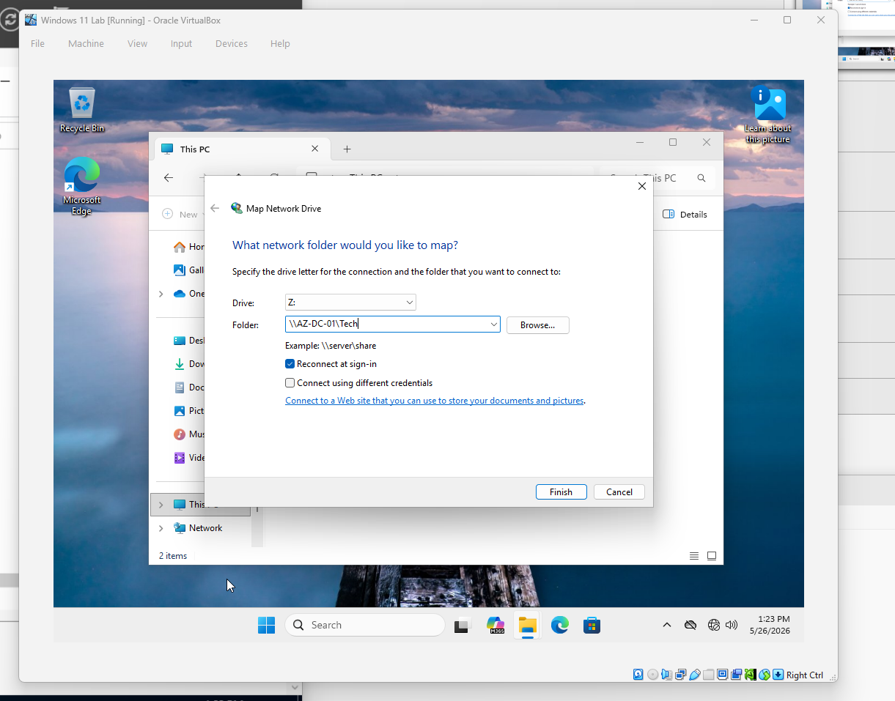
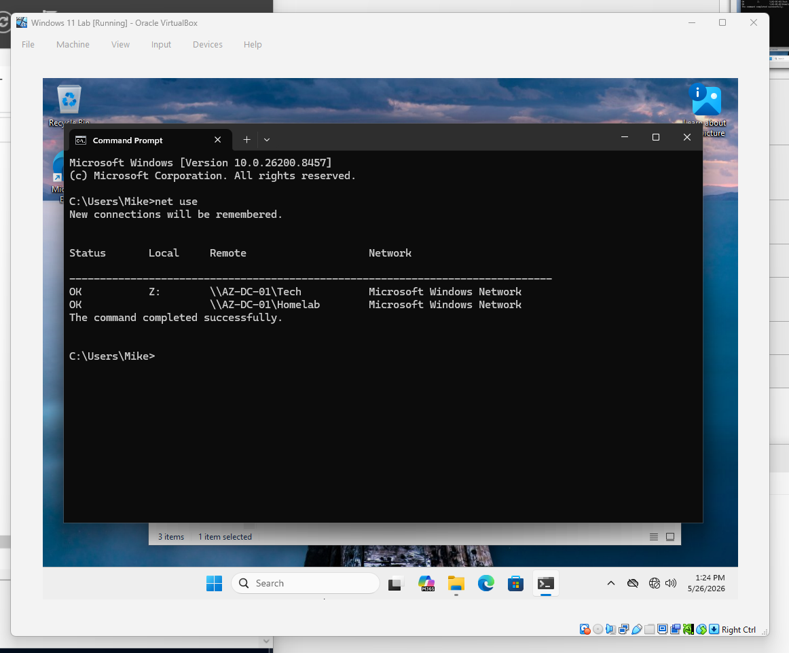
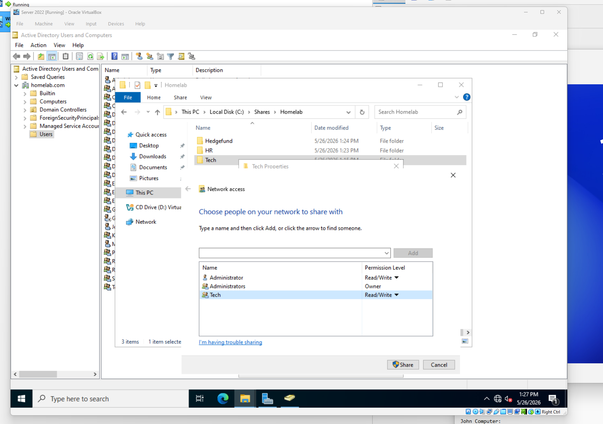
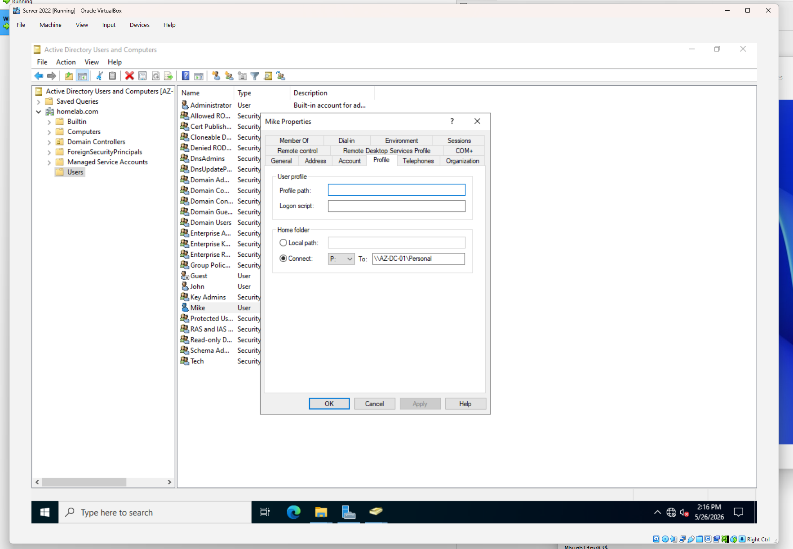

# Phase 4 – File, Folder, and Print Services

## Overview

The purpose of this phase was to gain hands-on experience managing shared resources within a Windows Server environment. This included creating network shares, configuring NTFS and share permissions, mapping network drives, implementing security group-based access control, creating user home folders, and deploying shared printers through Active Directory.

These tasks represent common responsibilities performed by Help Desk Technicians, Desktop Support Specialists, and Systems Administrators in enterprise environments.

---

## Objectives

* Create and manage network shares
* Configure NTFS and share permissions
* Implement security group-based access control
* Map network drives for users
* Configure user home directories
* Create and manage shared printers
* Verify user access to shared resources

---

## Environment

### Domain Controller

* Hostname: AZ-DC-01
* Operating System: Windows Server 2022

### Client Workstation

* Windows 11 Pro
* Domain Joined

### Domain

* homelab.com

### Tools Used

* Server Manager
* File and Storage Services
* Active Directory Users and Computers
* Print Management
* Windows Explorer
* Command Prompt

---

# Part A – Creating Network Shares

## Creating the Initial Share

Using Server Manager, a new network share was created.

Navigation path:

```text
Server Manager
→ File and Storage Services
→ Shares
→ New Share
```

The share was configured with administrator-only access during initial setup.

### Screenshot



---

## Verification

The share appeared successfully within the Shares management console.

### Screenshot



---

# Part B – Folder Permission Management

## Creating the Tech Folder

Inside the newly created share, a folder named:

```text
Tech
```

was created to simulate a department file share.

### Screenshot



---

## Configuring Share Permissions

The folder properties were opened and access permissions were modified.

The Everyone group was removed from access permissions to follow the principle of least privilege.

---

## Assigning User Permissions

The user account Mike was granted:

* Read permissions
* Write permissions
* Modify permissions

This allowed Mike to create, edit, and remove files within the shared folder.

### Screenshot



---

## Verification

The Mike account was used to access the shared folder from the Windows 11 workstation.

Successful access confirmed:

* Share permissions functioning correctly
* NTFS permissions functioning correctly
* Network connectivity functioning correctly

### Screenshot



---

# Part C – Network Drive Mapping

## Mapping the Shared Folder

While logged in as Mike, the shared folder was mapped as a network drive.

Navigation path:

```text
This PC
→ Show More Options
→ Map Network Drive
```

The UNC path for the shared folder was entered.

### Screenshot



---

## Verification

The mapped drive appeared successfully within File Explorer.

The following command was also used:

```cmd
net use
```

The output confirmed that the drive mapping had been established successfully.

### Screenshot



---

# Part D – Security Group-Based Access Control

## Creating the Tech Security Group

To demonstrate a more scalable and secure approach to permission management, a security group named:

```text
Tech
```

was created within Active Directory Users and Computers.

### Screenshot


---

## Adding Group Members

The Mike account was added to the Tech security group.

---

## Replacing Direct User Permissions

Instead of assigning permissions directly to Mike, permissions were removed from the individual account and assigned to the Tech security group.

This approach offers several benefits:

* Simplified administration
* Easier onboarding and offboarding
* Reduced permission sprawl
* Improved scalability

### Screenshot



---

## Verification

Mike retained access to the folder through membership in the Tech security group.

This confirmed successful implementation of role-based access control.

### Screenshot


---

# Part E – User Home Folder Configuration

## Creating the Personal Share

A second shared folder named:

```text
Personal
```

was created.

The purpose of this folder was to simulate user home directories commonly used in enterprise environments.

---

## Configuring User Home Folder

Within Active Directory Users and Computers, Mike's account properties were opened.

Navigation path:

```text
User Properties
→ Profile
→ Home Folder
```

The home directory was configured to connect automatically to the Personal share.

### Screenshot



---

## Verification

When Mike logged into the Windows 11 workstation, the Personal drive appeared automatically.

This demonstrated successful home folder mapping through Active Directory.

### Screenshot


---

# Part F – Home Folder Security Group

## Creating the Personal Security Group

To improve permission management, a security group named:

```text
Personal
```

was created.

---

## Assigning Group Permissions

Direct permissions assigned to Mike were removed.

The Personal security group was granted access instead.

Mike was then added to the group.

---

## Verification

Mike maintained access to the Personal share through group membership.

This validated the use of group-based access control for home directories.

### Screenshot


---

# Part G – Print Services

## Installing Print Services

The Print and Document Services role was installed through Server Manager.

Navigation path:

```text
Manage
→ Add Roles and Features
→ Print and Document Services
```

### Screenshot

*Insert screenshot showing Print Services installation*

---

## Opening Print Management

After installation, Print Management was opened from:

```text
Server Manager
→ Tools
→ Print Management
```

### Screenshot

*Insert screenshot showing Print Management console*

---

## Creating a Shared Printer

A new printer was added using the Add Printer Wizard.

For demonstration purposes, the following printer was selected:

```text
Generic IBM Graphics 9 Pin Wide
```

The printer was then shared and published within Active Directory.

### Screenshot

*Insert screenshot showing printer creation*

---

## Configuring Printer Permissions

Printer security settings were modified to grant access to the Tech security group.

This ensured that users assigned to the group could access the shared printer.

### Screenshot

*Insert screenshot showing printer security settings*

---

## Verification

The Mike account was used to verify printer availability from the Windows 11 workstation.

Successful access confirmed:

* Printer sharing functionality
* Active Directory integration
* Group-based printer permissions

### Screenshot

*Insert screenshot showing printer available on Windows 11*

---

# Troubleshooting Techniques Used

Throughout this phase, several administrative and troubleshooting tools were utilized.

### Verify Network Drive Mappings

```cmd
net use
```

### Verify Share Permissions

* Folder Properties
* Sharing Tab
* Security Tab

### Verify Group Membership

```cmd
net user mike /domain
```

### Verify Printer Deployment

* Print Management
* Devices and Printers

These tools are commonly used by support personnel when diagnosing file access and printer-related issues.

---

# Skills Demonstrated

* File Share Administration
* NTFS Permissions Management
* Share Permissions Management
* Network Drive Mapping
* Home Folder Configuration
* Security Group Administration
* Role-Based Access Control (RBAC)
* Printer Deployment
* Print Server Administration
* Active Directory Integration
* Windows Server File Services
* User Access Troubleshooting

---

# Outcome

Network shares, user home directories, and shared printers were successfully deployed and managed within the Active Directory environment. Access was controlled through security groups rather than direct user assignments, demonstrating enterprise best practices for permission management. These exercises provided practical experience with file services, print services, and resource access control commonly encountered in help desk and systems administration roles.
