# Phase 5 – Endpoint Management & Software Deployment

## Overview

The purpose of this phase was to gain hands-on experience with endpoint management, patch management, software deployment, and asset inventory solutions commonly used in enterprise environments.

To accomplish this, Action1 was used to manage updates and deploy agents, while PDQ Deploy and PDQ Inventory were used to deploy software and collect system information. These tools simulate many of the responsibilities performed by Help Desk Technicians, Desktop Support Specialists, Systems Administrators, and Managed Service Providers (MSPs).

---

## Objectives

* Deploy endpoint management software
* Install and manage Action1 agents
* Deploy Windows updates remotely
* Generate endpoint reports
* Deploy software using PDQ Deploy
* Inventory hardware and software using PDQ Inventory
* Verify endpoint management functionality

---

## Environment

### Domain Controller

* Hostname: AZ-DC-01
* Operating System: Windows Server 2022

### Client Workstation

* Windows 11 Pro
* Domain Joined

### Domain

* homelab.com

### Tools Used

* Action1
* PDQ Deploy
* PDQ Inventory
* VirtualBox Shared Folders
* Active Directory

---

# Part A – Action1 Deployment

## Creating an Action1 Account

An Action1 account was created and configured to manage endpoints within the lab environment.

After registration, the Action1 management portal was accessed through the web dashboard.

### Screenshot

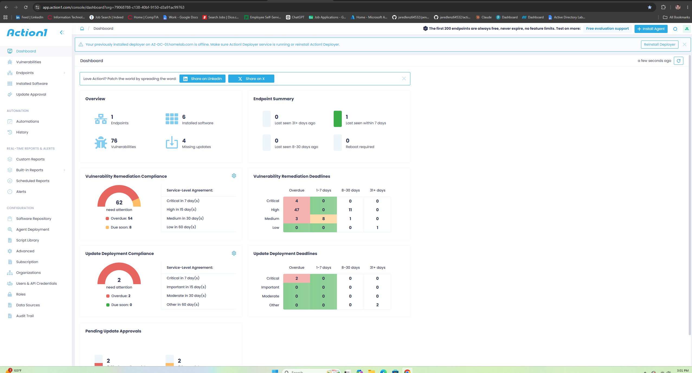

---

## Downloading the Agent

The Action1 endpoint agent was downloaded from the Action1 portal.

To transfer the installer into the virtual environment, the installer was copied into the VirtualBox shared folder and then accessed from the Windows Server 2022 virtual machine.

### Screenshot

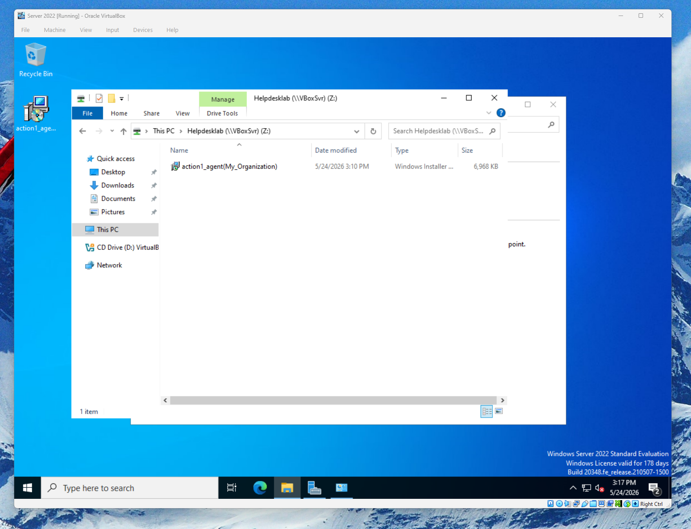

---

## Installing the Agent

The Action1 agent was installed on the Domain Controller.

To allow communication with the Action1 cloud platform, the network adapter was temporarily configured to use a bridged network connection.

Once internet connectivity was established, the installation completed successfully.

---

## Verification

After installation, the server appeared within the Action1 management dashboard.

This confirmed:

* Successful agent installation
* Internet connectivity
* Communication with the Action1 platform

### Screenshot

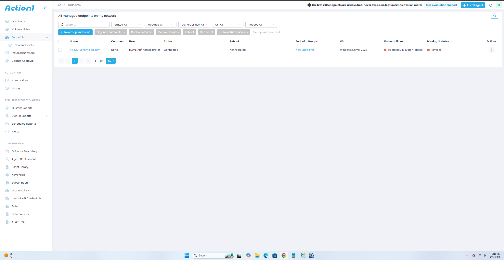

---

# Part B – Patch Management

## Reviewing Available Updates

Within Action1, the endpoint was scanned for available updates.

The platform identified applicable Windows updates that could be deployed remotely.

---

## Deploying Updates

Action1's patch management functionality was used to deploy updates to the Windows Server endpoint.

The update deployment process was initiated through the management dashboard.

---

## Verification

Following deployment, Action1 reported successful installation of the selected updates.

This verified:

* Endpoint management functionality
* Patch deployment capability
* Remote administration workflow

### Screenshot

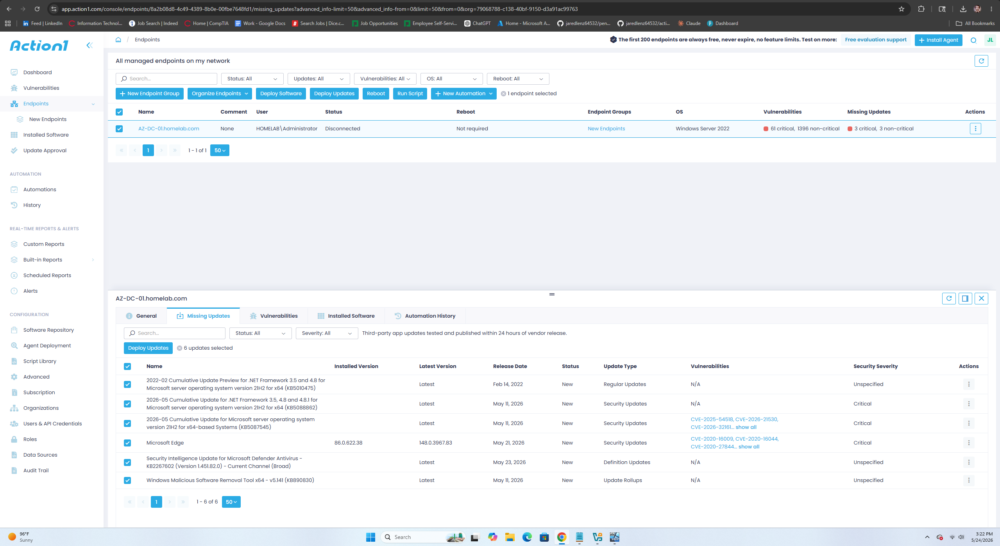

---

# Part C – Action1 Reporting

## Generating Endpoint Reports

Action1 includes reporting capabilities that allow administrators to review system status and compliance information.

Several report types were reviewed during testing, including:

* Managed endpoints
* Hardware inventory
* Endpoint status information

### Screenshot

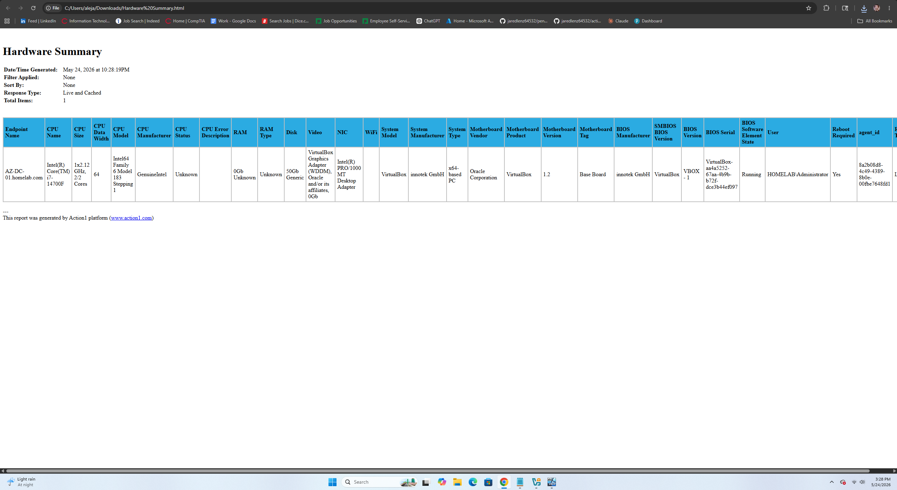

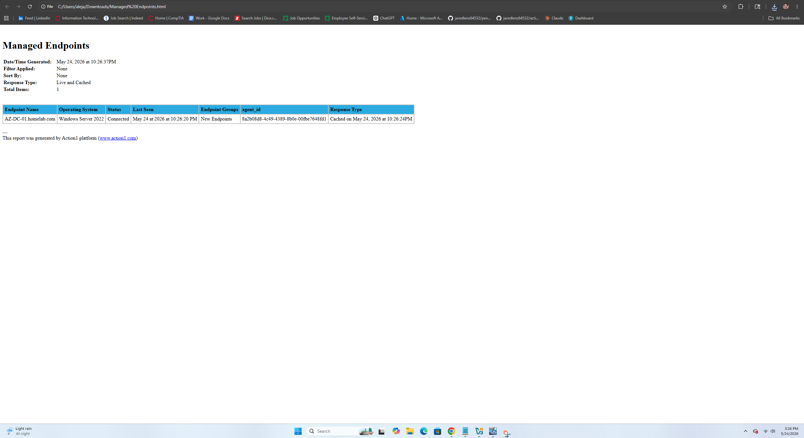

---

## Benefits of Reporting

Reporting tools provide administrators with visibility into:

* Hardware inventory
* Update compliance
* Endpoint health
* System status

These capabilities are frequently used in enterprise environments to maintain operational awareness and compliance.

---

# Part D – Action1 Agent Deployment

## Deploying Additional Agents

To simulate centralized endpoint management, Action1's Agent Deployment feature was configured.

Navigation path:

```text
Configuration
→ Agent Deployment
```

The deployment package was downloaded from the Action1 portal.

### Screenshot

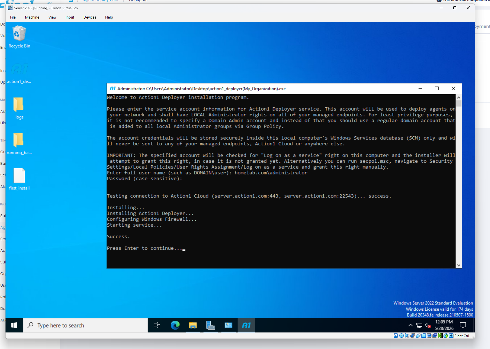

---

## Deploying the Agent

The deployment package was transferred to the server using the VirtualBox shared folder.

Deployment settings were configured to discover systems through Active Directory.

---

## Verification

Action1 successfully identified domain systems within scope for deployment.

This demonstrated centralized endpoint management capabilities.

### Screenshot

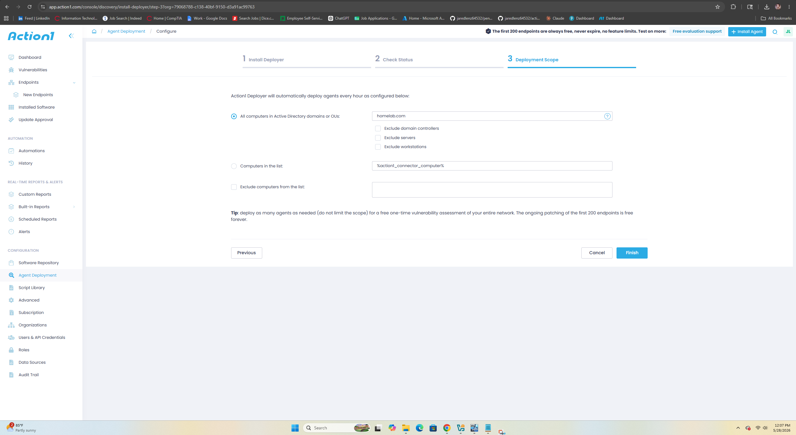

---

# Part E – PDQ Deploy

## Installing PDQ Deploy

PDQ Deploy was downloaded from the vendor's website and transferred into the lab environment through the VirtualBox shared folder.

The application was installed on the Windows Server 2022 Domain Controller.

### Screenshot

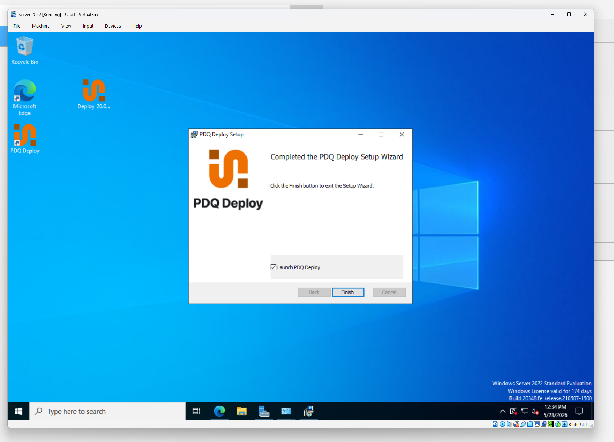

---

## Exploring Available Packages

After installation, the PDQ Deploy package library was reviewed.

PDQ Deploy provides preconfigured packages that allow administrators to deploy software remotely.

### Screenshot

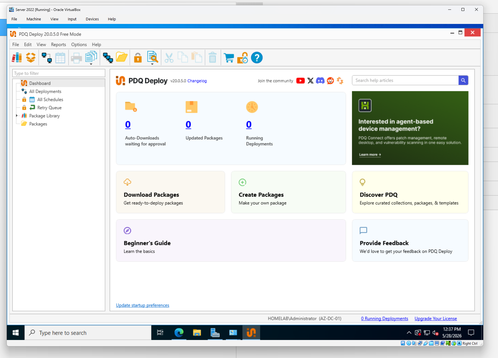

---

## Deploying Software

To test deployment functionality, the following application was selected:

```text
PDFsam
```

A deployment was initiated to the server endpoint.

### Screenshot

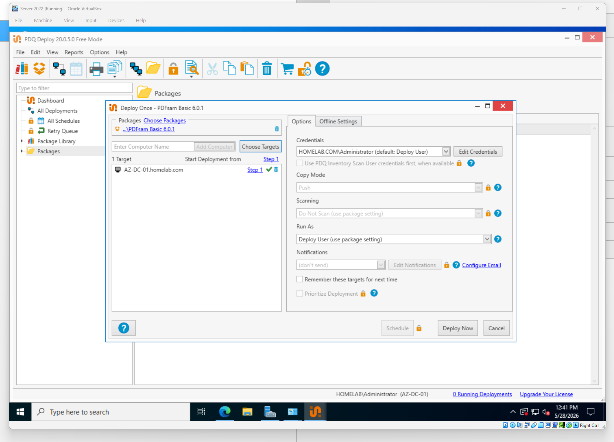

---

## Verification

The deployment completed successfully and the application appeared on the target system.

This confirmed:

* Software deployment functionality
* Package execution capability
* Endpoint connectivity

### Screenshot

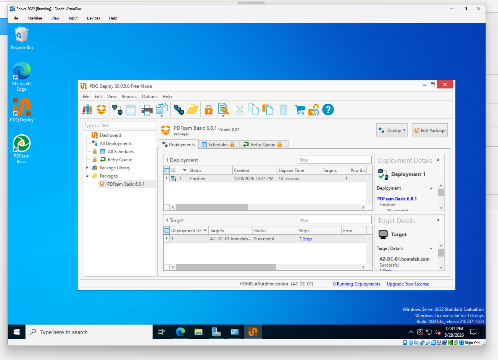

---

# Part F – PDQ Inventory

## Installing PDQ Inventory

PDQ Inventory was downloaded and installed on the Windows Server 2022 system.

The installation process was completed using the same deployment workflow utilized for PDQ Deploy.

### Screenshot

*Insert screenshot showing PDQ Inventory installation*

---

## Discovering Systems

PDQ Inventory was configured to collect information from managed systems.

The platform gathered extensive endpoint information including:

* Operating System details
* Hardware specifications
* Active Directory information
* Installed software

### Screenshot

*Insert screenshot showing system inventory data*

---

## Reviewing Hardware Information

PDQ Inventory was used to examine detailed hardware information for managed endpoints.

Examples include:

* CPU information
* Memory allocation
* Storage details
* Operating system version

### Screenshot

*Insert screenshot showing hardware inventory details*

---

## Reviewing Software Inventory

The platform was also used to review installed applications across managed endpoints.

This capability allows administrators to:

* Audit software installations
* Identify unauthorized applications
* Track software usage

### Screenshot

*Insert screenshot showing software inventory report*

---

# Part G – Reporting and Asset Visibility

## Inventory Reports

PDQ Inventory provides reporting capabilities that allow administrators to quickly assess endpoint status.

Examples include:

* All Computers
* Installed Applications
* Operating Systems
* Hardware Reports

### Screenshot

*Insert screenshot showing inventory reports*

---

## Administrative Benefits

Asset inventory systems provide:

* Improved visibility
* Faster troubleshooting
* Software auditing
* Hardware lifecycle management
* Compliance monitoring

These capabilities are commonly leveraged by Help Desk and Systems Administration teams.

---

# Troubleshooting Techniques Used

Several troubleshooting methods were utilized throughout this phase.

## Verify Endpoint Registration

* Action1 Dashboard
* Managed Endpoints

## Verify Internet Connectivity

```cmd
ping google.com
```

## Verify Software Installation

```cmd
appwiz.cpl
```

## Verify Inventory Collection

* PDQ Inventory
* Computer Details View

These tools assisted with validating endpoint management functionality and software deployment success.

---

# Skills Demonstrated

* Endpoint Management
* Patch Management
* Update Deployment
* Agent Deployment
* Asset Management
* Software Deployment
* Inventory Management
* Hardware Auditing
* Software Auditing
* Remote Administration
* Active Directory Integration
* IT Operations Support
* Endpoint Troubleshooting

---

# Outcome

Endpoint management solutions were successfully deployed and tested within the Active Directory environment. Action1 was used to manage updates, deploy agents, and generate reports, while PDQ Deploy and PDQ Inventory were used to deploy software and collect asset information. These activities provided practical experience with enterprise endpoint administration workflows commonly encountered in help desk, desktop support, and systems administration roles.
